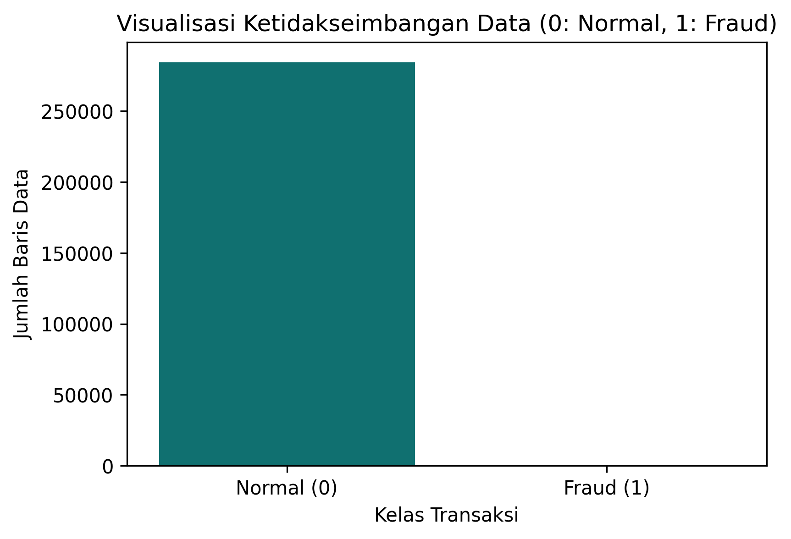
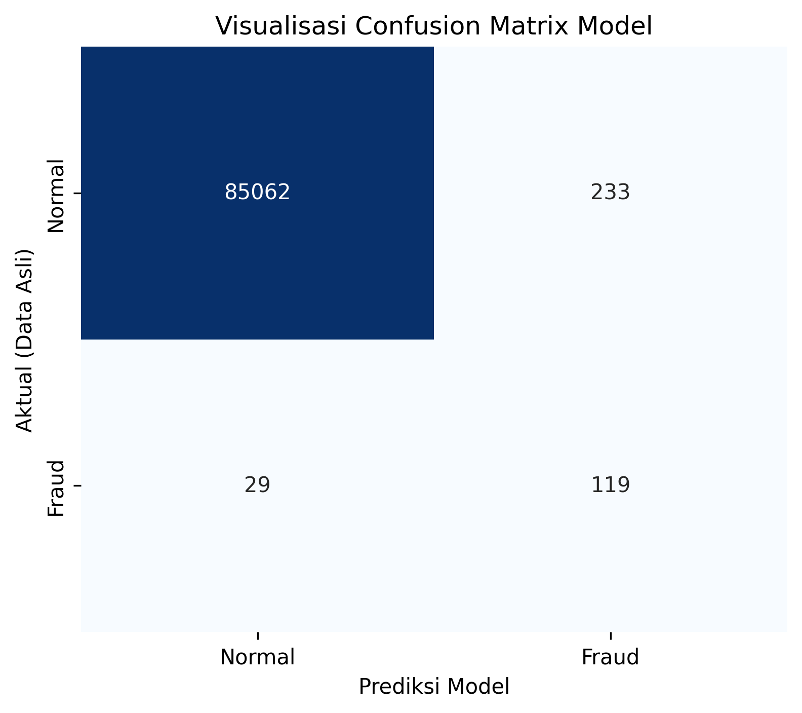

# Laporan Akhir Proyek Machine Learning: CreditShield (Deteksi Penipuan Kartu Kredit)

## 1. Business Understanding

### 1.1 Latar Belakang Masalah
Di era digitalisasi perbankan, transaksi menggunakan kartu kredit telah menjadi salah satu metode pembayaran utama masyarakat. Namun, kenyamanan ini diiringi dengan risiko keamanan yang signifikan. Penipuan kartu kredit (*credit card fraud*) mengakibatkan kerugian finansial yang masif hingga miliaran rupiah setiap tahunnya, baik bagi institusi penyedia kartu kredit maupun bagi nasabah itu sendiri. 

Tantangan terbesar dalam industri ini adalah mendeteksi pola fraud yang bergerak sangat cepat dan manipulatif. Deteksi manual oleh tim analis memiliki keterbatasan waktu dan rawan terhadap kesalahan manusia (*human error*). Oleh karena itu, diperlukan sebuah sistem komputasi cerdas yang mampu menganalisis ribuan transaksi secara otomatis dan real-time untuk mengenali indikasi kecurangan sebelum transaksi tersebut selesai diproses.

### 1.2 Tujuan Proyek
* **Membangun Model Prediktif:** Mengembangkan model klasifikasi berbasis machine learning yang mampu memisahkan transaksi normal dan transaksi fraud secara akurat.
* **Meminimalkan Lolosnya Kasus Fraud:** Berfokus pada peningkatan metrik *Recall* pada kelas fraud untuk memastikan seminimal mungkin transaksi penipuan yang lolos dari sistem.
* **Menyediakan Antarmuka Simulasi:** Membuat dashboard berbasis web (Streamlit) yang interaktif sehingga hasil analisis model machine learning dapat dipahami dengan mudah oleh pengguna atau tim analis keuangan.

---

## 2. Data Understanding

### 2.1 Karakteristik Dataset
Dataset yang digunakan dalam proyek ini mencakup total **284.807 transaksi** kartu kredit. Fitur dalam data ini meliputi:
* `Time`: Waktu jeda antara transaksi pertama dan transaksi berikutnya dalam dataset.
* `Amount`: Nilai nominal dari transaksi yang dilakukan.
* `V1` hingga `V28`: Fitur numerik hasil dari transformasi *Principal Component Analysis* (PCA) yang dilakukan demi menjaga kerahasiaan dan privasi data sensitif nasabah.
* `Class`: Label target di mana nilai **0** merepresentasikan transaksi Normal, dan nilai **1** merepresentasikan transaksi Fraud.

### 2.2 Analisis Ketidakseimbangan Data (Imbalanced Data)
Data ini memiliki tingkat ketidakseimbangan kelas yang sangat ekstrem (*highly imbalanced*). Dari total data, kelas Normal mendominasi sebanyak **284.315 transaksi**, sedangkan kasus penipuan (Fraud) hanya berjumlah **492 transaksi**.

Berikut adalah visualisasi distribusi kelas pada dataset asli:

Tantangan utama dari distribusi data seperti ini adalah model cenderung akan "malas" dan memilih untuk menebak semua transaksi sebagai kelas mayoritas (Normal) demi mendapatkan akurasi tinggi, namun gagal total dalam mendeteksi transaksi Fraud yang sebenarnya.

---

## 3. Data Preparation

Untuk mengatasi kendala ketidakseimbangan data dan memastikan performa model berjalan optimal, dilakukan beberapa tahapan *data preparation* berikut:

### 3.1 Feature Scaling (Standardisasi)
Fitur `Amount` memiliki rentang nilai nominal yang sangat besar dan bervariasi dibandingkan dengan fitur `V1`-`V28` yang merupakan hasil PCA. Oleh karena itu, fitur `Amount` diubah skalanya menggunakan `StandardScaler`. Proses ini mentransformasikan data sehingga memiliki rata-rata (*mean*) = 0 dan standar deviasi = 1.

### 3.2 Pemisahan Data (Data Splitting)
Dataset dibagi menjadi dua bagian dengan proporsi **70% untuk Data Training** dan **30% untuk Data Testing**. Pembagian ini menggunakan parameter `stratify=y` untuk memastikan bahwa proporsi kelas 0 dan kelas 1 tetap seimbang secara adil baik di data training maupun data testing.

### 3.3 Penanganan Data Imbalanced (SMOTE)
Guna menghindari bias model pada kelas mayoritas, teknik **SMOTE (Synthetic Minority Over-sampling Technique)** diimplementasikan khusus pada data training. SMOTE bekerja dengan cara membuat sampel baru yang sintetis pada kelas minoritas (Fraud) berdasarkan tetangga terdekatnya (*k-nearest neighbors*). Hasil akhir dari proses SMOTE ini membuat jumlah sampel kelas Normal dan kelas Fraud menjadi seimbang sebelum masuk ke tahap pelatihan model.

---

## 4. Modeling

Proyek ini menggunakan algoritma **Random Forest Classifier**. Algoritma ini dipilih karena berbasis *ensemble learning* (kumpulan pohon keputusan) yang sangat tangguh dalam menangani data tabular kompleks dan meminimalkan risiko *overfitting*.

### 4.1 Parameter Optimalisasi Kilat
Mengingat besarnya volume data setelah dilakukan SMOTE, model dikonfigurasi secara optimal untuk komputasi yang efisien tanpa memangkas performa akademis:
* `n_estimators=10`: Membentuk 10 pohon keputusan utama.
* `max_depth=10`: Membatasi kedalaman maksimum pohon hingga 10 tingkat untuk mempercepat durasi training model dan mencegah *overfitting*.
* `n_jobs=-1`: Memanfaatkan seluruh core prosesor yang tersedia pada server agar pelatihan berjalan paralel dan cepat.

---

## 5. Evaluation

Model dievaluasi menggunakan data testing (30% dari total dataset asli) yang belum pernah dilihat oleh model selama masa training. Hal ini bertujuan untuk menguji performa riil model di lapangan.

### 5.1 Confusion Matrix
Hasil prediksi nyata model terhadap data pengujian menghasilkan matriks berikut:

* **True Negative (TN):** 85.062 transaksi normal berhasil ditebak dengan benar sebagai transaksi normal.
* **False Positive (FP):** 233 transaksi normal salah ditebak sebagai transaksi fraud (salah sasaran).
* **False Negative (FN):** 29 transaksi fraud gagal terdeteksi (lolos dari sistem).
* **True Positive (TP):** 119 transaksi fraud berhasil dideteksi dengan akurat.

### 5.2 Metrik Evaluasi Utama
* **Precision (Kelas 1 / Fraud): 0.34 (34%)** Dari seluruh transaksi yang dituduh fraud oleh model, 34% di antaranya terbukti benar-benar fraud. Nilai ini wajar terjadi sebagai kompensasi dari penyeimbangan data menggunakan SMOTE.
* **Recall (Kelas 1 / Fraud): 0.80 (80%)** Model berhasil menangkap 80% dari total keseluruhan kasus fraud yang ada di data testing. Dalam studi kasus keuangan, nilai *Recall* yang tinggi jauh lebih diutamakan daripada *Precision*, karena bank lebih memilih mendeteksi salah sasaran (FP) daripada kecolongan transaksi penipuan (FN).
* **ROC AUC Score: 0.9583** Skor Area Under the ROC Curve yang mendekati angka **0.96** ini membuktikan secara ilmiah bahwa model memiliki kemampuan diskriminasi yang sangat kuat dan stabil dalam membedakan transaksi legal dan ilegal.

---

## 6. Deployment

Model machine learning yang telah dilatih kemudian diekspor ke dalam file biner (`fraud_model.pkl` dan `scaler.pkl`) menggunakan library *pickle*. Komponen ini kemudian diintegrasikan ke dalam skrip antarmuka **Streamlit** (`app.py`).

Aplikasi web dashboard **CreditShield** ini dirancang dengan antarmuka yang clean, minimalis, dan fungsional. Pengguna dapat memasukkan parameter transaksi secara langsung melalui slider atau kolom input, dan sistem akan langsung mengeluarkan hasil analisis apakah transaksi tersebut dikategorikan sebagai **AMAN / NORMAL** atau **INDIKASI FRAUD**, lengkap dengan nilai probabilitasnya secara real-time.
